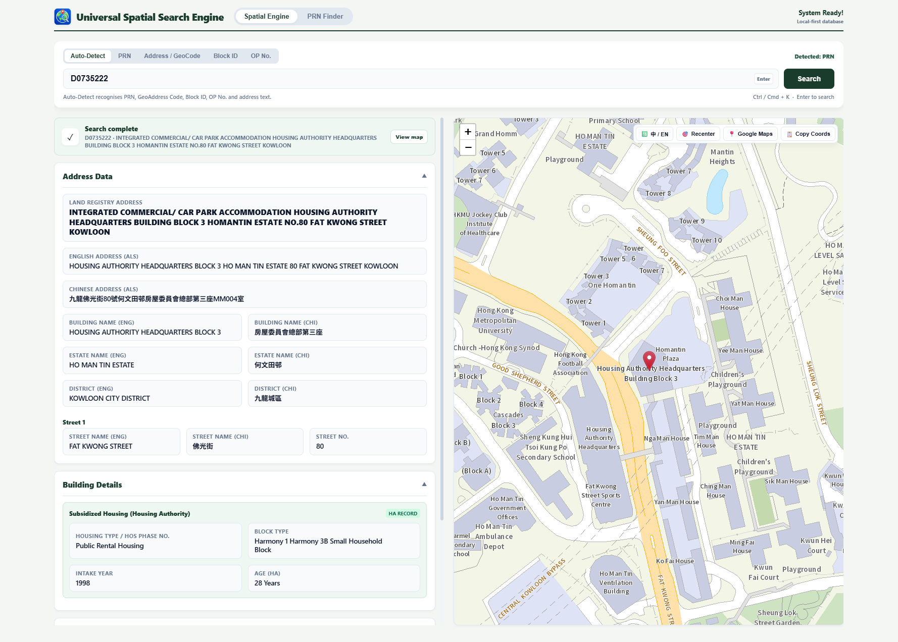
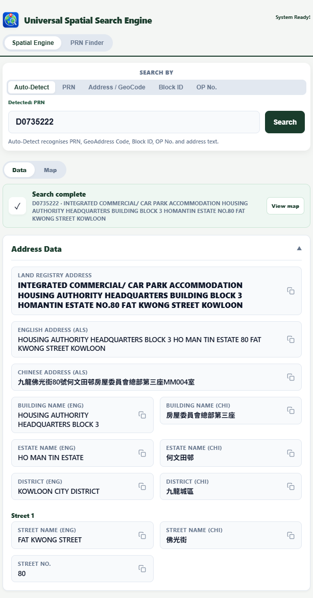

# Universal Spatial Search Engine 🌍🔍

**[👉 Click here to launch the app](https://hmcrcx.github.io/hkusse/)**

The Universal Spatial Search Engine is a fast, easy-to-use tool for looking up Hong Kong property, address, and spatial data. Whether you are at your office desktop or on your phone out in the field, this tool instantly cross-references multiple government databases to give you the exact property details you need.

## ✨ What It Can Do

*   **Smart Auto-Detect Search:** Just type what you know. The main search bar automatically recognizes Property Reference Numbers (PRN), GeoAddress Codes, Block IDs, OP Numbers, and regular address text.
*   **Property Finder:** Don't have the exact PRN? Use the built-in Finder tool to search by district, building name, street, or even a free-format address to track down the exact property.
*   **Comprehensive Property Details:** Instantly aggregates data from the Land Registry, Address Lookup Service (ALS), Buildings Department (BD), and Housing Authority (HA) into one clear, easy-to-read dashboard.
*   **Interactive Mapping:** View your search results on a built-in map with a single click. You can easily copy coordinates, switch between English and Chinese map labels, or jump straight to Google Maps.
*   **Works Anywhere:** Designed to look and feel like a modern, premium application whether you are using a large desktop monitor or a mobile phone.

## 🚀 How to Use the App

### On Desktop
Simply [open the website](https://hmcrcx.github.io/hkusse/) in your browser. 
*   *Pro-tip:* You can press **Ctrl + K** (or **Cmd + K** on Mac) to instantly jump to the search bar without using your mouse!

### On Mobile (iPhone & Android)
For the absolute best experience on your phone, you can install it directly to your home screen so it behaves exactly like a native app:
1. Open the website in **Safari** (iPhone) or **Chrome** (Android).
2. Tap the **Share** icon at the bottom of your screen.
3. Select **Add to Home Screen**.
4. Launch the app from your home screen for a smooth, full-screen experience!

## 📸 Screenshots

**Desktop Dashboard**  

**Mobile App View**  

---
*Disclaimer: Data is aggregated from public sources. Always verify critical property metrics with official Land Registry documents.*